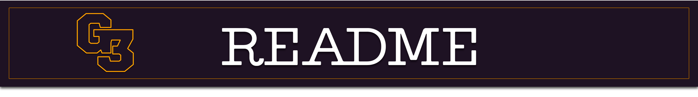

#curso-dds-cubos-academy

Arquivos e coisas relacionadas ao curso da cubos academy

- ### 1 Setup de ferramentas

o que é vscode, como baixar vscode, conhecendo vscode, o que é node.js, instalando node.js, terminal, como utilizat o terminal, o que é git, instalando git, o que é github e gitlab, tou pelo github, criando conta no github, criando repositório no github, os 4 comando do git, autenticação com ssh, clonado repositório, publicando um codigo no github, erro comum - configuração do git para o primeiro commit.

- ### 2 GitHub

git, github, ramificações - branch, git init, git clone, git status, git add, git reset, git commit, criando repositório no servidor remoto, git remote add origin, git push, git push, git checkout.

- ### 3 Variáveis

O que são variáveis, Como criar variáveis com const, Tentando mudar o valor de uma const, Como criar variáveis com let, Guardando números em variáveis, String template, Diferença de var, let e const,Resumo de variáveis, Exercício resolvido 1, Exercício resolvido 2, Escopo, Tipos de dados, Exemplificando com null e undefined, Operadores aritméticos, Mais operadores aritméticos
, Exercício resolvido 3, Exercício resolvido 4, Infinity e NaN, Atenção para utilizar os tipos corretos, Operador módulo, x++ e ++x, Como concatenar strings, Como calcular, potência e raiz quadrada

- ### 4

Exercicios

- ### 5 Condicionais

Introdução a aula de condicionais, Operadores de comparação >, <, >= e <=, Operadores de igualdade == e !=, Operadores de identidade === e !==, Resumo de operadores de comparação, Condicionais (if), Executando o código linha por linha - Debugger, Condicionais (if e else), Condicionais sem chaves, Condicionais (if, else if e else), Exemplo 1, E Lógico (&&), OU Lógico (||), NOT Operador de negação (!), Resumo de condicionais e operadores lógicos, Truthiness, Ternário, Resumo de ternário, Exercício resolvido 1, Determinando o número de casas decimais - .toFixed(), Exercício resolvido 2

- ### 6

Exercicios

- ### 7 Arrays e loops

O que são arrays, Como criar e acessar um array, Como modificar itens de um array, Tamanho de um array, push() e pop() - inserindo e removendo itens ao fim de um array, shift() e unshift() - inserindo e removendo itens ao começo de um array, Resumo de arrays, Exercício resolvido de arrays, While, For tradicional, Exercício Resolvido 2, Exercício Resolvido 3, For of, Iterando sobre strings e break, Exercício Resolvido 4, Exercício Resolvido 5, Exercício Resolvido 6

- ### 8

Exercicios
- ### 9

- ### 10

Exercicios

- ### 11 Objetos
 
Introdução a Objetos, Criando e manipulando Objetos, Resumo de Objetos, Notação de colchetes, Exercício resolvido 1, Melhorando o exercício 1, Ternário para melhorar ainda mais, Shorthand, Exercício resolvido 2, Exercício Resolvido 3, Exercício Resolvido 4, Desestruturação de Objetos, Spread Operator, Desestruturação de Arrays

- ### 12

Exercicios

- ### 13 Funçoes

Porque usar funções, Função - Apresentação formal, Criando a primeira função, Função com parâmetros, Exercício resolvido 1, Função com retorno, Exercício resolvido 2, Refatorando a função de apresentação, Exercício resolvido 3, Escopo de uma função (EXTRA), Arrow function, DRY - Dont Repeat Yourself, Métodos, console.log() é um método

- ### 14

Exercicios

- ### 15 Metodos de string

Documentação de Métodos de Strings, includes(), Exemplo com includes(), indexOf(), lastIndexOf(), slice(), Exercício com slice(), replace(), Exercício resolvido 1, Exercício resolvido 2, toUpperCase() e toLowerCase(), trim(), padStart(), Exercício resolvido 3, split(), Exercício resolvido 4

- ### 16

Exercicios

- ### 17 metodos de arrays 1

indexOf() e includes(), reverse(), Exercício resolvido 1, join(), Exemplo com join(), concat(), slice(), Exemplo com slice(), splice(), Exemplo com splice(), Diferença entre valor e referência

- ### 18

Exercicios

- ### 19 metodos de arrays 2
Every, Exemplo de uso do every, Exercício resolvido 1, Some, Exemplo de uso do some, Exercício resolvido 2, Find, Exemplos de uso do find, Exercício resolvido 3, FindIndex, Exemplos de uso do findIndex, Filter, Exemplos de uso do filter, Exercício resolvido 4, Map, Exemplo de uso do map, Exercício resolvido 5

- ### 20

Exercicios

- ### 21 metodos de arrays 3

Sort, Exemplo básico do reduce, Exemplo de ordenação de strings crescente e decrescente, Exemplo de ordenação padrão, Ordenação com função Callback, Exemplo de ordenação numérica com subtração, Exercício resolvido 1, Exemplo de ordenação padrão de strings, Comparar strings com o localeCompare, Exemplo de ordenação numérica crescente e decrescente, Exercício resolvido 2, Reduce, Exemplo debug reduce, Redução de um array de arrays, Exercício resolvido 3

- ### 22

Exercicios

- ### 23 Como funciona a internet

Computadores, IP e Rotas, Cloud, DNS, URL, Protocolo HTTP

- ### 24 Primeiro Servidor
NPM, Pacotes, Site NPM, Primeiro projeto com o NPM, Package.json, Gitignore, Exemplo de uso de um pacote do Node.js, Exemplo de importação de arquivos, Express.js, Documentação Express.js, Primeiro servidor com o Express.js, Revisão do primeiro servidor com o Express.js, Exercício Resolvido

- ### 25 Rotas intermediarios e Controladores

Rotas e Controladores, Configuração inicial do servidor, Informações da Requisição, Nodemon, Insomnia, Parâmetros de rotas no Express.js, Parâmetros de Consulta no Express.js, rganização dos Controladores, Intermediários, Intermediários independentes, Intermediários na rota, Exercício resolvido 1, Exercício resolvido 2

